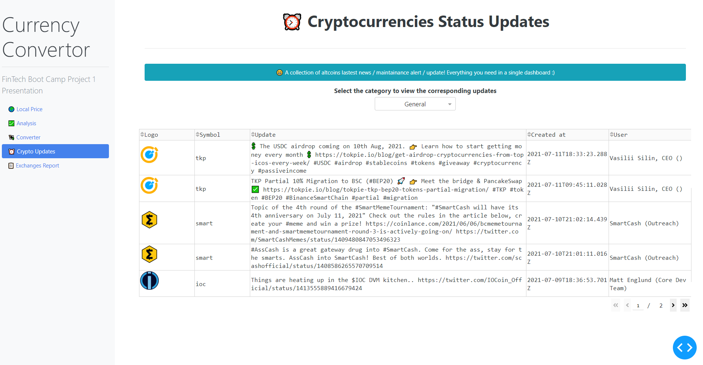

# Solution Document - Crypto Updates Dashboard
---

> 

---

## Problem Statement

* As a cryptocurrency investor I would like to be updated on the various announcements

---

## APIs used:

* API Provider - *CoinGecko API V3* (3.0.0) [Link](https://www.coingecko.com/api/documentations/v3)

* Endpoint - /status_updates

---

## Solution Steps

1. Define categories as a list and initialise it with the values 'general', 'software_release', 'milestone', 'exchange_listing'

2. Using the request library in python, call the Get() method to receive the data in JSON format

```
    enpoint_url = f"https://api.coingecko.com/api/v3/status_updates?category={cat}&project_type=coin&per_page=20&page=1"
    status_upd_json = api.get(enpoint_url).json()
```

3. Do data cleansing, if there are any null values

4. Populate the dataframe and return it to the calling .py file for plotting on the dashboard

---