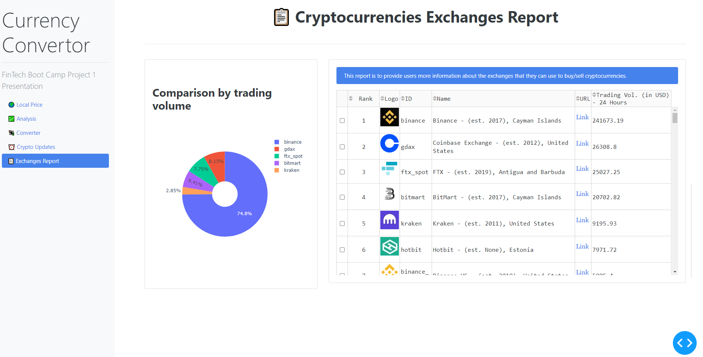

# Solution Document - Crypto Exchanges data Dashboard
---

> 

## Problem Statement

* As a person interested in investing in cryptocurrencies, I would like to know about the various exchanges that I can use to buy/sell cryptocurrencies

---

## APIs used:

* API Provider - CoinGecko API V3 (3.0.0) [Link](https://www.coingecko.com/api/documentations/v3)

* Endpoint - /exchanges

---

## Solution Steps

1. Define the dataframe structure where you want to store the data before plotting it on the dashboard

```
    df_exchanges_data = pd.DataFrame(columns=['Rank', 'Logo', 'ID', 'Name', 'URL', 'trade_volume_24h_btc'], index=None)
```

2. Using the request library in python, call the *get()* method to receive the data in JSON format

```
    enpoint_url = f"https://api.coingecko.com/api/v3/exchanges"
    exc_data_json = api.get(enpoint_url).json()
```

3. Do data cleansing, if there are any null values

4. Populate the dataframe and return it to the calling .py file for plotting on the dashboard

---