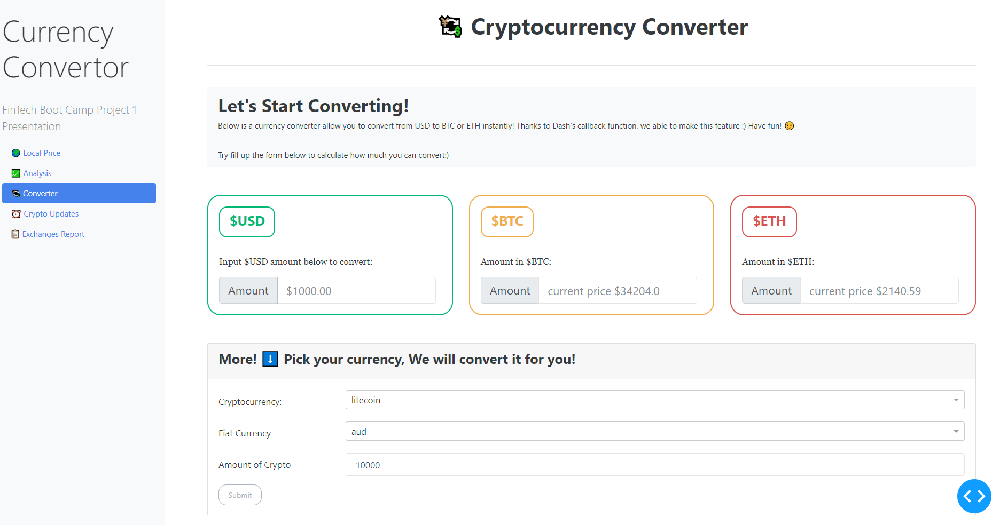
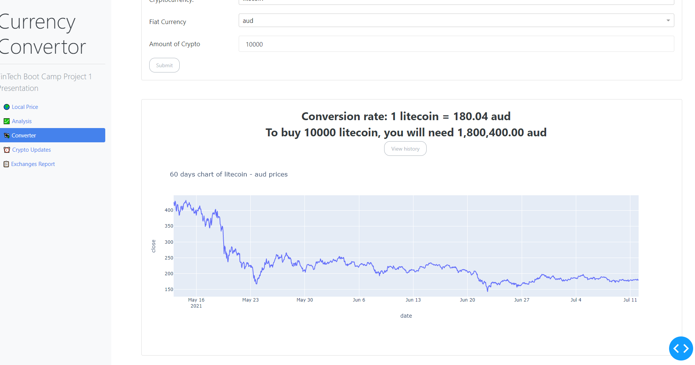

# Solution Document - Crypto Converter
---

> 
> 

---
## Problem Statement

* As a person interested in investing in cryptocurrencies, I would like to know the conversion rates between the various cryptocurrency coins and the national currency in my country. 
* I would also like to know the trends in the conversion rates over the last few weeks/months

---

## APIs used:

* API Provider - *API Alternative V2* [Link](https://alternative.me/crypto/api/)

* API Provider - *CoinGecko API V3* (3.0.0) [Link](https://www.coingecko.com/api/documentations/v3)

* Endpoint - /simple/price

---

## Solution Steps

1. Using the requests library, call the API Alternative URL to fetch the prices for Bitcoin vs AUD and Ethereum vs AUD  

```
    btc_url = "https://api.alternative.me/v2/ticker/Bitcoin/?convert=AUD"
    eth_url = "https://api.alternative.me/v2/ticker/Ethereum/?convert=AUD"
    btc_url = btc_url + "?format=json"
    eth_url = eth_url + "?format=json"
    # Fetch current BTC price
    btc_price = api.get(btc_url)
    # Fetch current ETH price
    eth_price = api.get(eth_url)
```

2. Create the dataframe for displaying on the dashboard

3. Create a list of all the crypto currencies and the fiat currencies you want to provide in the calculator

```
    crypto_coins = ['bitcoin','ethereum','litecoin','ripple','eos','monero','stellar']
    fiat = ['usd','aud','eur','gbp','cad','sgd']
```

4. Call the endpoint URL to get the json data

```
    enpoint_url = f"https://api.coingecko.com/api/v3/simple/price?ids={crypto_str}&vs_currencies={fiat_str}"
    exc_data_json = api.get(enpoint_url).json()
```

5. Create a dataframe to store the data received from the GET Request

6. To display the 60 days chart, use the *get_coin_market_chart_by_id( )* method provided by the pycoingecko library. Call the method using the parameters - crypto currency and the fiat currency
```
    data = gecko.get_coin_market_chart_by_id( coin, vs_currency= curr, days= days )
```
---