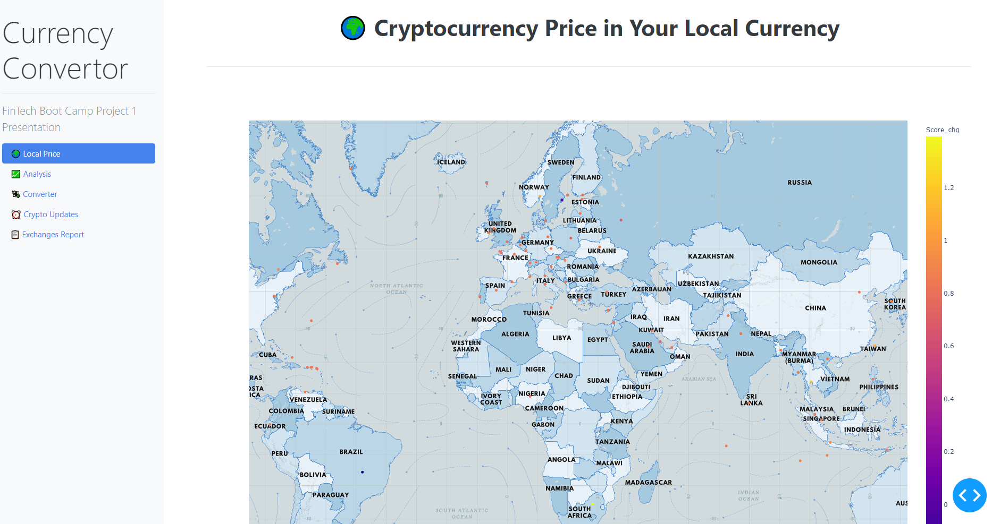

# Solution Document - Crypto Worldwide prices
---

> 

---

## Problem Statement

* As a person interested in buying crypto, I would like to know all the countries and the currencies where I can buy cryptocurrencies 

---

## CSV Data:

* *Kaggle.com* [Link](https://www.kaggle.com/nikitagrec/world-capitals-gps)

## APIs used:

* API Provider - *Country.io* [Link](http://country.io/currency.json)

* API Provider - *CoinGecko API V3* (3.0.0) [Link](https://www.coingecko.com/api/documentations/v3)
---

## Solution Steps

1. Get the mapbox api token from the environments file and initialise plotly express using it   

2. Get the currency codes for the countries using the *Country.io* API and store them in a dataframe

3. Read the concap.csv, downloaded from *Kaggle.com* and load the data into a dataframe

4. Check if there are any null values in the two dataframes and delete them using *dropna()*

5. Get data from Coingecko using the *get_price()* function provided by the pycoingecko library

```
    crypto_prices = gecko.get_price(ids=['bitcoin','litecoin', 'ripple'], vs_currencies=fiat, include_market_cap=True, include_24hr_vol=True, include_24hr_change=True)
```

6. Using the data received from pycoingecko, form 3 dataframes to store the price data, the volume data and the price-change data

7. Combine the countries data, the prices data, the price-change data, and the volume data into 1 dataframe

8. Plot the dataframe as a a scatter_mapbox using plotly.express
```
    map1 = px.scatter_mapbox(
        df_plot,
        lat="CapitalLatitude",
        lon="CapitalLongitude",
        color="Score_chg",
        hover_name='CountryName',
        hover_data= hover_data, #['CapitalName', 'Curr_code' ],
        zoom = 2,
        mapbox_style='mapbox://styles/mapbox/cjcunv5ae262f2sm9tfwg8i0w',
        height=1000
    )
```
---