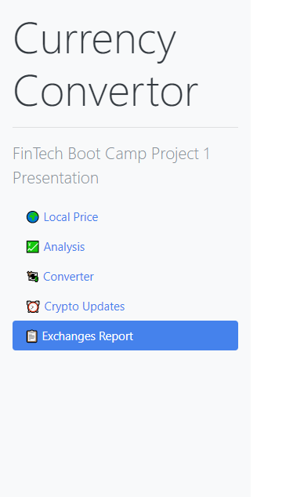

# Solution Document - Crypto Exchanges data Dashboard

> 

## Problem Statement

* As a person interested in investing in crypto, I would like to have a dashboard which can provide me with multiple analysis reports, updates, etc. about the cryptocurrency markets across the world

---
## Libraries used

- Dash
- dash_bootstrap_components

---
## Solution Steps

1. Call the functions defined in *Functions_data_graphs.py* and get the dataframes and the plots to be displayed on the dashboard

2. Load the dash components

```
app = dash.Dash(__name__, external_stylesheets=[dbc.themes.LITERA], suppress_callback_exceptions=True)
```

3. Set the styling of the sidebar and the main page area

```
# styling the sidebar
SIDEBAR_STYLE = {
    "position": "fixed",
    "top": 0,
    "left": 0,
    "bottom": 0,
    "width": "20rem",
    "padding": "2rem 1rem",
    "background-color": "#f8f9fa",
}

# padding for the page content
CONTENT_STYLE = {
    "margin-left": "24rem",
    "margin-right": "3rem",
    "padding": "2rem 1rem",
}
```

4. Define the navigation links for the sidebar component

```
# define sidebar variables
sidebar = html.Div(
    [
        html.H2("Currency Convertor", className="display-4"),
        html.Hr(),
        html.P(
            "FinTech Boot Camp Project 1 Presentation", className="lead"
        ),
        dbc.Nav(
            [
                dbc.NavLink("🌍 Local Price", href="/", active="exact"),
                dbc.NavLink("💹 Analysis", href="/page-1", active="exact"),
                dbc.NavLink("💱 Converter", href="/page-2", active="exact"),
                dbc.NavLink("⏰ Crypto Updates", href="/page-3", active="exact"),
                dbc.NavLink("📋 Exchanges Report", href="/page-4", active="exact"),
            ],
            vertical=True,
            pills=True,
        ),
    ],
    style=SIDEBAR_STYLE,
)
```

5. Load the application and run it
```
app.layout = html.Div([
    dcc.Location(id="url"),
    sidebar,
    content
])

if __name__=='__main__':
    app.run_server(debug=True, port=3000)
```

## Callback functions

1. **render_page_content**

    This callback function is called when the user clicks on a link on the sidebar. It takes care of loading the page which is requested from the Sidebar. The input received is the URL suffix for the target page, and the function returns the child component, which are dash core components, or dash html components or dash datatables

2. **update_status_tab**

    This callback function is called from the **Crypto Updates** page. The input received is the category name from the dropdown. This function returns the filtered status updates datatable back to the calling component

3. **update_exchange_pie**

    This callback function is called from the **Exchanges Report** tab, when the user has selected some exchanges, displayed on the datatable. The input received are the indices of the datatable rows which are selected. The function returns a pie chart displaying the 24-hour trading volume of the exchanges

4. **sync_input**

    This callback function is called from the **Converter** tab, when the user inputs a number in one of the 3 cards - *$USD*, *BTC* or *ETH*. The inputs received are the values that are entered in the 3 cards. The function computes the values for ETH and BTC and returns them to be displayed on the cards

5. **update_conv_price**

    This callback function is called from the **Converter** tab, when the user choses values in the *Cryptocurrency* and the *Fiat Currency* dropdowns and enters an amount in the *Amount of Crypto* field, and clicks *Submit*. The function computes the total value, sets it into a markdown component and returns it to the Converter tab

6. **on_click**

    This callback function is called from the **Converter** tab, when the user clicks on the *View history* button. the inputs received are the values selected in the *Cryptocurrency* and *Fiat currency* dropdowns. The function calls the *get_hist_chart()* function defined in *Functions_data_graphs.py* and returns to the calling component with a 60 day history chart
