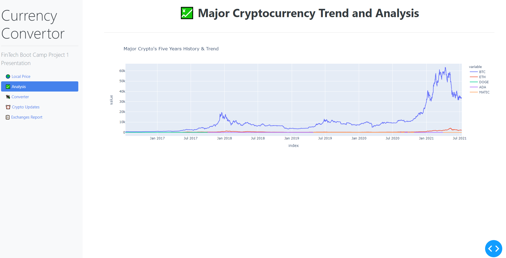

# Solution Document - Crypto Analysis - 5 years
---

> 

---
## Problem Statement

* As a person interested in investing in cryptocurrencies, I would like to know how the price of the leading cryptocurrencies have changed in the last 5 years

---

## APIs used:

* API Provider - *yfinance* [Link](https://pypi.org/project/yfinance/)

---

## Solution Steps

1. Call the *download()* method provided by the yfinance library

```
    df_ticker_low = yf.download(['BTC-USD' , 'ETH-USD', 'DOGE-USD', 'ADA-USD', 'MATIC-USD'], period='5y', group_by= 'ticker', dtype= object)
```

2. Create the dataframe containing the data that has been downloaded from yfinance

3. Plot a *plotly express line graph* to display the data in the data frame

```
    fig = px.line(df_closing_prices, y=["BTC", "ETH", "DOGE", "ADA", "MATIC"], title= "Major Crypto's Five Years History & Trend" )
```
